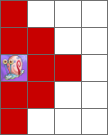

# grid2img 

Converts a grid file (text-JSON) into an image. The grid file has a simple format and is meant to 
be edited by hand. 

## Grid File Syntax

A 2D array of integers defines the grid. The numbers in the array are keys to the Tiles list. Each tile
can be a flat color or an image.

This grid file:

```{
	"Cells":
	[
		[1,0,0],
		[0,2,0],
		[0,0,3],
		[0,0,0],
		[0,0,0],
		[6,0,0]
	],

	"Tiles":
	{
		"1":{"Color":{"R":200,"G":0,"B":0,"A":255}},
		"2":{"Color":{"R":200,"G":0,"B":200,"A":255}},
		"6":{"Color":{"R":0,"G":160,"B":0,"A":255}},
 		"3":{"Color":{"R":0,"G":0,"B":0,"A":255}, "Image":"test.jpg"}
	},

	"CellWidth":30,
	
	"GridLInes":
	{
		"Color":{"R":0,"G":0,"B":0,"A":150},
		"Width":1
	}
}
```

Will produce this output: 




## Usage

`grid2img --grid [gridfile.json] --image [output.png]`

If `--grid` is missing it will default to grid.json. If `--image` is missing it will default to img.png.


